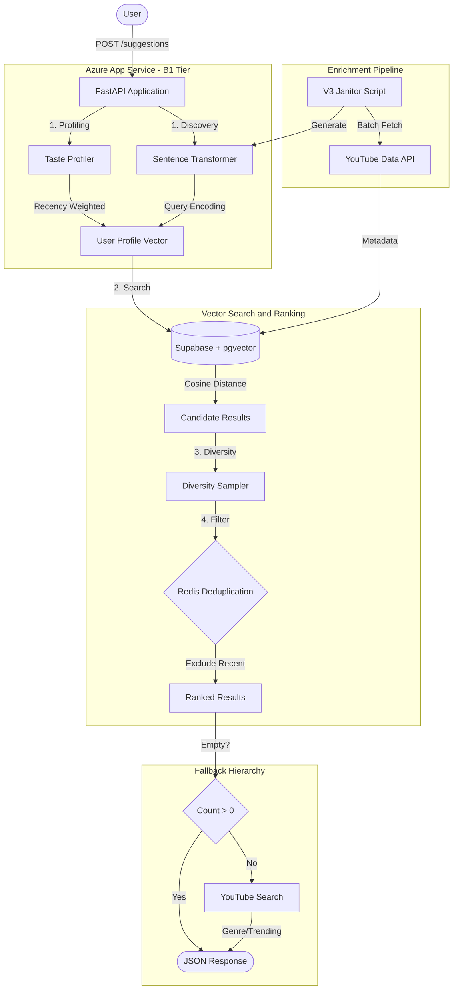

# TuneTrace: Semantic Music Recommendation API

A FastAPI microservice that provides AI-powered music recommendations using semantic vector search. The engine leverages the all-MiniLM-L6-v2 model to encode song metadata into 384-dimensional dense vectors and retrieves the most semantically similar tracks via cosine distance on a pgvector-enabled PostgreSQL database.

**Production URL**: https://song-suggest-fastapi-ajaqgfa8aja8crbn.southeastasia-01.azurewebsites.net/

**Documentation**: https://song-suggest-fastapi-ajaqgfa8aja8crbn.southeastasia-01.azurewebsites.net/docs

---

## System Architecture


```mermaid
graph TD
    User([User]) -->|POST /suggestions| API[FastAPI Application]
    
    subgraph Compute_Layer [Azure App Service - B1 Tier]
        API -->|1. Profiling| Profiler[Taste Profiler]
        Profiler -->|Recency Weighted| ProfileVector[User Profile Vector]
        
        API -->|1. Discovery| Encoder[Sentence Transformer]
        Encoder -->|Query Encoding| ProfileVector
    end
    
    subgraph Search_Engine [Vector Search and Ranking]
        ProfileVector -->|2. Search| PGV[(Supabase + pgvector)]
        PGV -->|Cosine Distance| Candidates[Candidate Results]
        
        Candidates -->|3. Diversity| Shuffler[Diversity Sampler]
        Shuffler -->|4. Filter| Redis{Redis Deduplication}
        Redis -->|Exclude Recent| FinalResults[Ranked Results]
    end
    
    subgraph Resilience_Layer [Fallback Hierarchy]
        FinalResults -->|Empty?| Check{Count > 0}
        Check -->|No| YTFallback[YouTube Search]
        Check -->|Yes| Out([JSON Response])
        YTFallback -->|Genre/Trending| Out
    end
    
    subgraph Maintenance [Enrichment Pipeline]
        Janitor[V3 Janitor Script] -->|Batch Fetch| YouTube[YouTube Data API]
        YouTube -->|Metadata| PGV
        Janitor -->|Generate| Encoder
    end
```

---

## Recommendation Pipeline (Version 3.0)

The TuneTrace recommendation system utilizes a multi-tier approach to ensure relevance, discovery, and high availability.

### 1. Primary Algorithm: Semantic Vector Search
The core engine uses a content-based approach mapping musical attributes into a high-dimensional semantic space.

*   **Model Architecture**: Uses all-MiniLM-L6-v2, a distilled Transformer model optimized for real-time inference on CPU-constrained environments.
*   **Vectorization**: Concatenates song titles, artists, genres, and tags into a unified descriptive string before encoding into a 384-dimensional vector.
*   **User Profiling**: Calculates a weighted average of a user's liked song embeddings.
*   **Recency Decay**: Implements a temporal weighting strategy where recent interactions have a higher influence on the profile vector than older history.
*   **Similarity Metric**: Uses Cosine Distance (<=> in pgvector) to find the nearest neighbors in the latent space.

### 2. Feature Flags and Logic Toggles
The architecture supports conditional features that can be toggled via configuration or deployment scale.

*   **Collaborative Filtering (STATUS: INACTIVE)**: The codebase contains an implementation for user-to-user collaborative filtering. This is currently disabled via feature flag to prioritize semantic accuracy for smaller user bases and reduce computational overhead on the B1 tier.
*   **Diversity Injection (STATUS: ACTIVE)**: To prevent echo chambers, the system performs a weighted random sample from the top 50 semantic matches, ensuring the user sees a mix of high-confidence and "discovery" tracks.
*   **Repetition Exclusion (STATUS: ACTIVE)**: Uses a Redis-backed bloom filter/set to track recently recommended video IDs. Songs are excluded from the response if they have been suggested to the user within the last 24 hours.

### 3. Fallback and Resilience Hierarchy
To ensure a "never-empty" response, the system follows a deterministic fallback chain:

1.  **Tier 1: Semantic Match**: The preferred method using vector similarity.
2.  **Tier 2: Metadata Heuristic**: If the vector search yields zero results, the system attempts to find songs matching the specific genre tags provided in the request.
3.  **Tier 3: Genre Trending**: Queries the YouTube Data API for the current top-performing tracks within the user's preferred genre.
4.  **Tier 4: Global Trending**: The ultimate fallback which retrieves the top global music charts to ensure the user receives valid content regardless of history or catalog state.

---

## API Contract

### Endpoints

#### 1. POST /suggestions
Get AI-powered song suggestions based on a user's liked songs.

**Request Body**:
```json
{
  "user_id": "user@example.com",
  "songs": ["Shape of You - Ed Sheeran"],
  "genre": "Pop"
}
```

**Fields**:
*   user_id: Unique identifier for the user.
*   songs: List of song titles used for profile generation.
*   genre: Preferred genre used for fallback logic.

---

#### 2. POST /discover
Semantic discovery: search by mood, song name, or free-text description.

**Request Body**:
```json
{
  "query": "late night driving music with heavy bass",
  "limit": 10
}
```

---

## Deployment and Optimization

### Azure App Service (B1 Plan)
The backend is specifically tuned for the resource constraints of the Azure B1 instance (1.75 GB RAM).

*   **Baked-in Models**: Model weights are downloaded during the CI/CD build process and included in the Docker image. This eliminates network-bound cold starts and prevents timeout errors during scaling events.
*   **Worker Configuration**: Running 2 Gunicorn workers with a 90-second timeout. This balance prevents RAM exhaustion while allowing sufficient time for the model to load into memory during startup.
*   **Connection Pooling**: Uses SQLAlchemy pooling to manage database connections efficiently across workers.

---

## Database Schema

### Table: song_metadata
Contains the vectorized music catalog.
*   **embedding**: vector(384) - Indexed using HNSW for sub-second search performance.

### Table: user_liked_songs
Join table mapping users to their musical preferences, enabling the recency-weighted profiling logic.

---
## Cold Startup Time

Typical startup in a cold boot for the fastapi server would be around 2-4 minutes.

