## Enhanced Music Suggestion API

A FastAPI microservice that provides music suggestions using the YouTube Data API v3. The service analyzes a user's liked songs and returns similar tracks. It includes robust fallback mechanisms to always return relevant results when possible.

-Production URL: https://song-suggest-microservice.onrender.com


##  API Contract

### Endpoints

#### 1. POST /suggestions
**Description**: Get AI-powered song suggestions based on user's liked songs using collaborative filtering.

**Request Body** (JSON):
```json
{
  "user_id": "user@example.com",
  "songs": ["Shape of You - Ed Sheeran", "Blinding Lights - The Weeknd"],
  "genre": "Pop"
}
```

**Fields**:
- `user_id` (required): User email or OAuth identifier (max 255 chars)
- `songs` (required): Array of song titles, 1-50 items
- `genre` (optional): Genre for fallback suggestions (max 128 chars)

**Response** (200 OK):
```json
{
  "suggestions": [
    {
      "title": "Billie Eilish - bad guy",
      "artist": "Billie Eilish",
      "youtube_video_id": "kJQP7kiw5Fk"
    }
  ]
}
```

**Errors**: 
- 400 (invalid input - exceeds limits)
- 500 (internal server error)
- 503 (YouTube API unavailable)

---

#### 2. GET /liked-songs
**Description**: Returns the list of songs a user has previously liked.

**Query Parameters**:
- `user_id` (required): User email or OAuth identifier

**Example**: `GET /liked-songs?user_id=user@example.com`

**Response** (200 OK):
```json
[
  {
    "video_id": "dQw4w9WgXcQ",
    "title": "Rick Astley - Never Gonna Give You Up",
    "artist": "Official Rick Astley",
    "created_at": "2025-09-30T14:23:45.123456"
  }
]
```

**Errors**: 
- 500 (failed to retrieve liked songs)

---

#### 3. GET /health
**Description**: Health check endpoint to confirm service is running.

**Response** (200 OK):
```json
{
  "status": "healthy"
}
```

---

##  Recommendation Algorithm (Version 2.0)

**Goal**: Provide high-quality, personalized song recommendations using collaborative filtering with YouTube Data API.

### Hybrid Recommendation Approach

#### Primary: Collaborative Filtering
1. **User Identification**: Store user preferences by email/OAuth ID
2. **Song Resolution**: Search YouTube for each liked song → Store metadata in database
3. **Find Similar Users**: Query users who liked ≥2 same songs as current user
4. **Generate Recommendations**: Return songs liked by similar users but not by current user
5. **Ranking**: Sort by popularity among similar users (most liked first)

#### Secondary: Content-Based Fallback
- **Trigger**: No collaborative data available (new user or insufficient overlap)
- **Method**: Search YouTube for popular songs by specified genre
- **Default**: Global top hits if no genre specified
- **Limit**: Returns up to 10 suggestions

### Performance Optimizations

**Caching Strategy**:
- **LRU Cache**: 512-entry cache for YouTube search results (in-memory)
- **Redis Cache**: User preferences with configurable TTL (default: 1 hour)
- **Background Tasks**: Redis updates happen asynchronously (non-blocking)
- **Database Indexing**: Optimized queries on user_id, song_id, video_id

**Latency Targets**:
- Database queries: <200ms (with Redis)
- YouTube API calls: 5-8s timeout with error handling
- Overall response: 40% faster with caching

### Input Validation & Security

**Request Limits** (to prevent DoS):
- Max 50 songs per request
- Max 255 chars for user_id
- Max 128 chars for genre
- Max 200 chars per song query

**Input Sanitization**:
- Alphanumeric + spaces, hyphens, apostrophes only
- Minimum 2-character queries
- Empty/invalid queries skipped with warnings

**Error Handling**:
- YouTube API timeouts handled gracefully
- Sanitized error messages (no sensitive data leakage)
- Comprehensive logging for debugging
- 
Client Layer: External applications that consume the API
API Gateway: FastAPI with CORS middleware for cross-origin support
REST Endpoints: Three main endpoints for liked songs, suggestions, and health checks
Business Logic: Core functions handling song persistence, suggestion generation, and fallback mechanisms
Caching Strategy: Dual-layer caching with in-memory LRU cache and database-backed cache
ML Processing: TF-IDF vectorization and cosine similarity for intelligent song recommendations
Data Access Layer: SQLAlchemy ORM with multiple models for users, songs, and recommendations
External Integration: YouTube Data API v3 for fetching video metadata and suggestions
Storage: SQLite database for persistent storage
The architecture follows a clean separation of concerns with proper layering, caching for performance, and a fallback mechanism to ensure reliability.

```mermaid
%%{init: {"theme":"light"}%%
graph TB
  subgraph CLIENT[" CLIENT LAYER"]
    Client["Client Applications\nWeb • Mobile • Desktop"]
  end

  subgraph GATEWAY[" API GATEWAY"]
    CORS["CORS Middleware\nCross-Origin Resource Sharing"]
    FastAPI["FastAPI Server\nAsync • Fast • Modern"]
  end

  subgraph ENDPOINTS["🔌 REST ENDPOINTS"]
    GET_LIKED["GET /liked-songs\nRetrieve User Favorites"]
    POST_SUGGEST["POST /suggestions\nAI-Powered Recommendations"]
    GET_HEALTH["GET /health\nService Status Check"]
  end

  subgraph CORE["CORE LOGIC"]
    AUTH["Request Validator\nPydantic Models"]
    COMBINE["Suggestion Engine\ncombine_suggestions()"]
    YT_SUGGEST["YouTube Integration\nget_youtube_suggestions()"]
    FALLBACK["Fallback System\nget_popular_song_fallback()"]
    PERSIST["Like Persistence\n_persist_user_likes()"]
    LOAD["Like Retrieval\n_load_user_likes()"]
  end

  subgraph CACHE[" CACHING SYSTEM"]
    MEM_CACHE["Memory Cache\nLRU Cache\nTTL: 3600s"]
    DB_CACHE["Database Cache\nQueryCache Table"]
  end

  subgraph ML[" ML PIPELINE"]
    TFIDF["TF-IDF Vectorizer\nText Feature Extraction"]
    COSINE["Cosine Similarity\nContent Matching"]
    SCORING["Scoring Algorithm\nHeuristic + ML Fusion"]
  end

  subgraph DATA[" DATA LAYER"]
    SESSION["SQLAlchemy ORM\nSession Management"]
    subgraph MODELS["Database Models"]
      USER_MODEL["User"]
      LIKED_MODEL["UserLikedSong"]
      SONG_MODEL["Song"]
      REC_MODEL["Recommendation"]
      VIDEO_MODEL["VideoFeature"]
      CACHE_MODEL["QueryCache"]
    end
  end

  subgraph EXTERNAL[" EXTERNAL APIS"]
    YOUTUBE["YouTube Data API v3\nSearch • Videos • Related"]
  end

  subgraph STORAGE[" STORAGE"]
    SQLITE["SQLite Database\nmusic_recommender.db"]
  end

  %% Request Flow
  Client -->|HTTPS| CORS
  CORS --> FastAPI
  FastAPI --> GET_LIKED
  FastAPI --> POST_SUGGEST
  FastAPI --> GET_HEALTH

  %% GET /liked-songs flow
  GET_LIKED -.->|Validate| AUTH
  AUTH -.-> LOAD
  LOAD -.-> SESSION
  SESSION -.-> USER_MODEL
  SESSION -.-> LIKED_MODEL

  %% POST /suggestions flow
  POST_SUGGEST -->|Validate| AUTH
  AUTH --> PERSIST
  PERSIST --> SESSION
  AUTH --> COMBINE
  COMBINE -->|Cache Hit?| MEM_CACHE
  COMBINE -->|Cache Miss| YT_SUGGEST
  YT_SUGGEST -->|API Call| YOUTUBE
  YOUTUBE -->|Video Data| TFIDF
  TFIDF --> COSINE
  COSINE --> SCORING
  SCORING --> COMBINE
  COMBINE -->|Fallback| FALLBACK
  FALLBACK -->|API Call| YOUTUBE
  COMBINE -->|Store| MEM_CACHE

  %% Database connections
  SESSION --> SQLITE
  USER_MODEL -.-> SQLITE
  LIKED_MODEL -.-> SQLITE
  SONG_MODEL -.-> SQLITE
  REC_MODEL -.-> SQLITE
  VIDEO_MODEL -.-> SQLITE
  CACHE_MODEL -.-> SQLITE
  DB_CACHE -.-> CACHE_MODEL

  %% Spotify-inspired styling
  classDef spotifyGreen fill:#1DB954,stroke:#FFFFFF,stroke-width:2px,color:#000000
  classDef spotifyBlack fill:#191414,stroke:#1DB954,stroke-width:2px,color:#FFFFFF
  classDef spotifyGray fill:#212121,stroke:#1DB954,stroke-width:1px,color:#FFFFFF
  classDef spotifyWhite fill:#FFFFFF,stroke:#1DB954,stroke-width:2px,color:#000000
  classDef spotifyAccent fill:#1ED760,stroke:#FFFFFF,stroke-width:2px,color:#000000
  classDef externalStyle fill:#535353,stroke:#1DB954,stroke-width:2px,color:#FFFFFF

  class GET_LIKED,POST_SUGGEST,GET_HEALTH spotifyGreen
  class Client,FastAPI spotifyAccent
  class AUTH,COMBINE,YT_SUGGEST,FALLBACK,PERSIST,LOAD spotifyBlack
  class MEM_CACHE,DB_CACHE,SESSION spotifyGray
  class TFIDF,COSINE,SCORING spotifyWhite
  class YOUTUBE externalStyle
  class SQLITE spotifyGray
  class USER_MODEL,LIKED_MODEL,SONG_MODEL,REC_MODEL,VIDEO_MODEL,CACHE_MODEL spotifyGray
  class CORS spotifyBlack
```


<!-- This is an auto-generated reply by CodeRabbit -->





##  Usage Examples

curl (POST /suggestions)
```
curl -X POST \
  https://song-suggest-microservice.onrender.com/suggestions \
  -H "Content-Type: application/json" \
  -d '{
        "user_id": "demo-user",
        "songs": ["Blinding Lights", "Shape of You"]
      }'
```

curl (GET /liked-songs)
```
curl "https://song-suggest-microservice.onrender.com/liked-songs?user_id=demo-user"
```

curl (GET /health)
```
curl "https://song-suggest-microservice.onrender.com/health"
```

---

##  Database Schema

### Tables

#### users
```sql
CREATE TABLE users (
    id SERIAL PRIMARY KEY,
    user_id VARCHAR(255) UNIQUE NOT NULL,  -- OAuth email
    name VARCHAR(255),                      -- Display name
    email VARCHAR(255),                     -- Email address
    created_at TIMESTAMP DEFAULT NOW(),
    updated_at TIMESTAMP DEFAULT NOW()
);
CREATE INDEX idx_users_user_id ON users(user_id);
CREATE INDEX idx_users_email ON users(email);
```

#### song_metadata
```sql
CREATE TABLE song_metadata (
    id SERIAL PRIMARY KEY,
    video_id VARCHAR(64) UNIQUE NOT NULL,
    title VARCHAR(512) NOT NULL,
    artist VARCHAR(256) NOT NULL,
    genre VARCHAR(128),
    tags TEXT,
    updated_at TIMESTAMP DEFAULT NOW()
);
CREATE INDEX idx_song_video_id ON song_metadata(video_id);
CREATE INDEX idx_song_genre ON song_metadata(genre);
```

#### user_liked_songs
```sql
CREATE TABLE user_liked_songs (
    id SERIAL PRIMARY KEY,
    user_id INTEGER REFERENCES users(id) ON DELETE CASCADE,
    song_id INTEGER REFERENCES song_metadata(id) ON DELETE CASCADE,
    created_at TIMESTAMP DEFAULT NOW(),
    UNIQUE(user_id, song_id)
);
```

### Migration

To update existing databases, run:
```bash
# Using Alembic
alembic upgrade head

# Or manually apply migration
# See: alembic/versions/add_user_oauth_fields.py
```

---

##  Frontend Integration

**OAuth User Flow**:
1. Frontend authenticates user via Google OAuth (NextAuth.js)
2. Extract user email from session: `session.user.email`
3. Pass email as `user_id` in API requests

**Example (fetch)**:
```javascript
async function getSuggestions(userId, songs, genre = null) {
  const res = await fetch("https://song-suggest-microservice.onrender.com/suggestions", {
    method: "POST",
    headers: { "Content-Type": "application/json" },
    body: JSON.stringify({ 
      user_id: userId,  // user email from OAuth
      songs: songs,     // max 50 songs
      genre: genre      // optional
    })
  });
  if (!res.ok) throw new Error(`HTTP ${res.status}`);
  const data = await res.json();
  return data.suggestions;
}

async function getLikedSongs(userId) {
  const res = await fetch(
    `https://song-suggest-microservice.onrender.com/liked-songs?user_id=${encodeURIComponent(userId)}`
  );
  if (!res.ok) throw new Error(`HTTP ${res.status}`);
  return await res.json();
}
```

---

## ⚙️ Configuration

Environment variables (Render -> Environment)
- YOUTUBE_API_KEY: Required.
- SQLITE_DATABASE_URL: Optional. Defaults to `sqlite:///app.db`.
- POSTGRES_DATABASE_URL: Optional. Render Postgres connection URL. If omitted but `DATABASE_URL` is set to a Postgres URL, it will be used.
- DATABASE_URL: Backward-compatibility for Postgres.
- DB_READ_PREFERENCE: `postgres` (default) or `sqlite`.
- REDIS_URL: Optional. Render internal Redis URL (free tier supported).
- REDIS_TTL_SECONDS: Optional. Default `3600`.

Start command (Render)
```
uvicorn main:app --host 0.0.0.0 --port $PORT
```

Dependencies
- See `requirements.txt`. Includes SQLAlchemy and scikit‑learn for the ranking logic.

CORS
- CORS is set to allow all origins by default for ease of integration. Restrict in production as needed.

---


---

##  Health Check
```
GET https://song-suggest-microservice.onrender.com/health (for internal testing of FastAPI instance)
Response: { "status": "healthy" }
```

##  Testing (Bruno Collection)

For contributors and developers, this repository includes a **Bruno** collection for testing the API.

1.  **Install Bruno**: [https://www.usebruno.com/](https://www.usebruno.com/)
2.  **Open Collection**: In Bruno, click "Open Collection" and select the `TuneTrace-Backend` folder in the root of this repo.
3.  **Select Environment**: Choose "Production" from the environment dropdown (top right).
4.  **Run Requests**:
    *   **Health**: Check if API is running.
    *   **Get Suggestions**: Trigger the ML recommendation engine.
    *   **Get Liked Songs**: Verify database/cache persistence.
