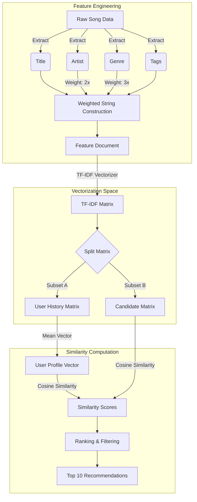
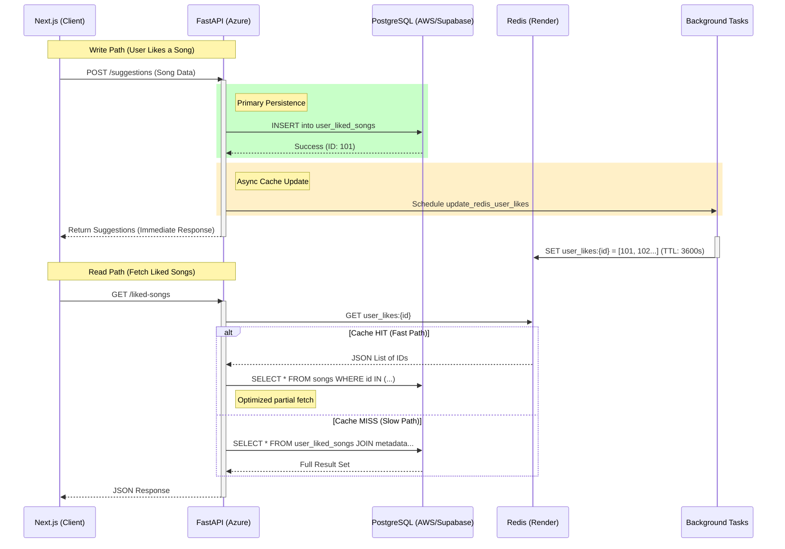

# Technical Architecture & Implementation Analysis: TuneTrace

## 1. Machine Learning Methodology

The TuneTrace recommendation engine employs a **Content-Based Filtering** architecture designed to address the "cold start" problem inherent in collaborative filtering systems. By analyzing the intrinsic attributes of audio entities rather than user behavioral clusters, the system generates personalized recommendations immediately upon a user's initial interaction.

### Algorithmic Pipeline

The recommendation logic is encapsulated within the `MLEngine` class, utilizing Scikit-Learn to process textual metadata into a vectorized feature space.

### Architectural Evaluation

The implemented pipeline demonstrates three key technical advantages:

1. **Weighted Feature Engineering:** The algorithm explicitly weights the "Artist" (2x) and "Genre" (3x) tokens during feature string construction. This heuristic biases the vector space to prioritize stylistic and authorial similarity over incidental keyword matches in song titles.
2. **Zero-Inference Latency:** By avoiding complex neural network inference in favor of linear algebra operations (Cosine Similarity on TF-IDF vectors), the system maintains low latency even as the candidate set scales.
3. **Popularity Fallback Mechanism:** To mitigate the "filter bubble" effect common in content-based systems, the logic includes a fallback mechanism. If the ML engine returns no recommendations (e.g., due to a lack of distinct user history or candidate songs), the system retrieves trending entities from the "Popular Song" chart, ensuring the user is never presented with an empty state.

---

## 2. Unified Persistence Architecture

The application utilizes a **Write-Behind Caching** pattern to decouple the high-throughput read requirements of the frontend from the transactional integrity of the primary database.

### Infrastructure Components

* **Presentation Layer:** Next.js application hosting the interactive UI.
* **Logic Layer:** FastAPI microservice deployed on Azure App Service.
* **Caching Layer:** Redis instance (hosted on Render) providing low-millisecond access to user history, configured with a 1-hour TTL (Time To Live).
* **Persistence Layer:** PostgreSQL database (hosted via Supabase/AWS) serving as the source of truth for user relations and song metadata.

---

## 3. CI/CD Automation Pipeline

The deployment lifecycle is managed via GitHub Actions, establishing a continuous delivery pipeline to the Azure App Service.

```mermaid
graph LR
    subgraph Source_Control [Source Control]
        A[Push to 'main'] --> B(Trigger Workflow)
    end

    subgraph Build_Job [CI: Build Job Ubuntu Latest]
        B --> C[Checkout Code]
        C --> D[Setup Python 3.11]
        D --> E[Install Dependencies]
        E --> F["Upload Artifact<br/>(Excludes venv: !antenv)"]
    end

    subgraph Deploy_Job [CD: Deploy Job Azure]
        F --> G[Download Artifact]
        G --> H[Azure Login via OIDC]
        H --> I[Deploy to Web App]
    end

    subgraph Production [Environment]
        I --> J[Azure Web App: 'song-suggest-fasapi']
        J --> K[Production Slot]
    end

```

### Configuration Specifications

* **Artifact Optimization:** The pipeline utilizes the `!antenv/` exclusion pattern during artifact upload. This prevents the local virtual environment from being transmitted to Azure, allowing the platform's native Oryx build engine to handle dependency resolution efficiently.
* **Secure Authentication:** The pipeline implements OpenID Connect (OIDC) via `azure/login@v2`. This protocol eliminates the need for long-lived static credentials, relying instead on short-lived tokens authenticated against the Azure Tenant ID and Subscription ID.
