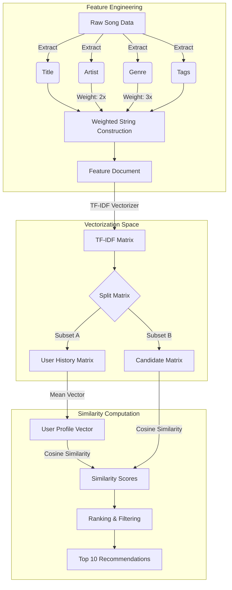
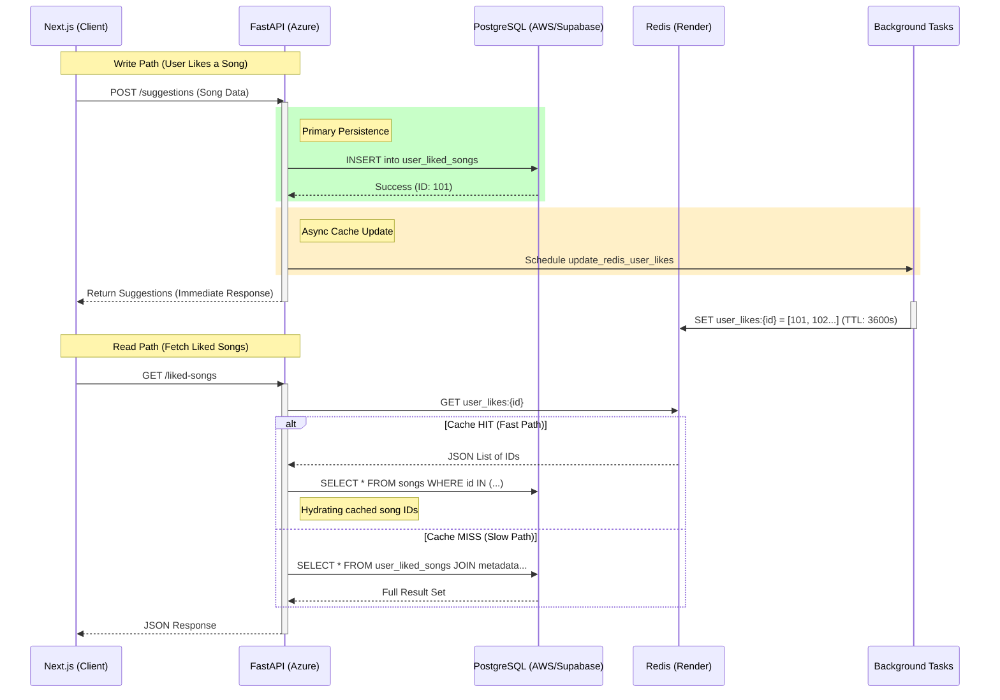

# Technical Architecture & Implementation Analysis: TuneTrace

## 1. Machine Learning Methodology

The TuneTrace recommendation engine employs a **Content-Based Filtering** architecture designed to address the "cold start" problem inherent in collaborative filtering systems. By analyzing the intrinsic attributes of audio entities rather than user behavioral clusters, the system generates personalized recommendations immediately upon a user's initial interaction.

### Algorithmic Pipeline

The recommendation logic is encapsulated within the `MLEngine` class, utilizing Scikit-Learn to process textual metadata into a vectorized feature space.

```mermaid
graph TD
    subgraph Feature_Engineering [Feature Engineering]
        A[Raw Song Data] -->|Extract| B(Title)
        A -->|Extract| C(Artist)
        A -->|Extract| D(Genre)
        A -->|Extract| E(Tags)
        
        B --> F[Weighted String Construction]
        C -->|Weight: 2x| F
        D -->|Weight: 3x| F
        E --> F
        
        F --> G[Feature Document]
    end

    subgraph Vectorization [Vectorization Space]
        G -->|TF-IDF Vectorizer| H[TF-IDF Matrix]
        H --> I{Split Matrix}
        I -->|Subset A| J[User History Matrix]
        I -->|Subset B| K[Candidate Matrix]
    end

    subgraph Similarity [Similarity Computation]
        J -->|Mean Vector| L[User Profile Vector]
        L & K -->|Cosine Similarity| M[Similarity Scores]
        M --> N[Ranking & Filtering]
        N --> O[Top 10 Recommendations]
    end

```

### Architectural Evaluation

The implemented pipeline demonstrates several key technical advantages over naive content-based systems:

1. **Weighted Feature Engineering:** The algorithm explicitly weights the "Artist" (2x) and "Genre" (3x) tokens during feature string construction using space-separated replication, ensuring proper TF-IDF vectorization counting without creating merged nonsense tokens.
2. **Exponential Recency Decay:** User profile vectors are built not as a flat average of their history, but by applying an exponential decay weight favoring recently liked songs, ensuring recommendations adapt to evolving user tastes.
3. **Diversity-Aware Selection:** Pure similarity ranking often creates "filter bubbles" or echo chambers. The `MLEngine` dedicates a percentage (e.g., 40%) of the final response to high-scoring but diverse candidates sampled via pseudorandom selection, enhancing discovery.
4. **Strict Noise Thresholds:** A minimum cosine similarity threshold (e.g., `0.05`) is enforced. Candidates failing this threshold are discarded.
5. **Popularity Fallback Mechanism:** If the ML engine returns zero recommendations (new user or isolated taste profile), the system seamlessly retrieves trending collaborative or categorical entities.
---

## 2. Unified Persistence Architecture

The application utilizes a **Write-Through Caching** pattern with asynchronous cache updates to balance the high-throughput read requirements of the frontend with the transactional integrity of the primary database.

```mermaid
sequenceDiagram
    participant FE as Next.js (Client)
    participant API as FastAPI (Azure)
    participant DB as PostgreSQL (AWS/Supabase)
    participant Cache as Redis (Render)
    participant BG as Background Tasks

    Note over FE, API: Write Path (User Likes a Song)
    FE->>API: POST /suggestions (Song Data)
    activate API
    
    rect rgb(200, 255, 200)
        Note right of API: Primary Persistence
        API->>DB: INSERT into user_liked_songs
        DB-->>API: Success (ID: 101)
    end

    rect rgb(255, 240, 200)
        Note right of API: Async Cache Update
        API->>BG: Schedule update_redis_user_likes
    end
    
    API-->>FE: Return Suggestions (Immediate Response)
    deactivate API

    activate BG
    BG->>Cache: SET user_likes:{id} = [101, 102...] (TTL: 3600s)
    deactivate BG

    Note over FE, API: Read Path (Fetch Liked Songs)
    FE->>API: GET /liked-songs
    activate API
    
    API->>Cache: GET user_likes:{id}
    alt Cache HIT (Fast Path)
        Cache-->>API: JSON List of IDs
        API->>DB: SELECT * FROM songs WHERE id IN (...)
        Note right of API: Hydrating cached song IDs
    else Cache MISS (Slow Path)
        API->>DB: SELECT * FROM user_liked_songs JOIN metadata...
        DB-->>API: Full Result Set
    end
    
    API-->>FE: JSON Response
    deactivate API

```

### Infrastructure Components

* **Presentation Layer:** Next.js application hosting the interactive UI.
* **Logic Layer:** FastAPI microservice deployed on Azure App Service.
* **Caching Layer:** Redis instance (hosted on Render) providing low-millisecond access to user history, configured with a 1-hour TTL (Time To Live).
* **Persistence Layer:** PostgreSQL database (hosted via Supabase/AWS) serving as the source of truth for user relations and song metadata.

---

## 3. CI/CD Automation Pipeline

The deployment lifecycle is managed via GitHub Actions, establishing a continuous delivery pipeline to the Azure App Service.

```mermaid
graph LR
    subgraph Source_Control [Source Control]
        A[Push to 'main'] --> B(Trigger Workflow)
    end

    subgraph Build_Job [CI: Build Job on Ubuntu 22.04]
        B --> C[Checkout Code]
        C --> D[Setup Python 3.11]
        D --> E[Install Dependencies]
        E --> F["Upload Artifact<br/>(Excludes venv: !antenv)"]
    end

    subgraph Deploy_Job [CD: Deploy Job Azure]
        F --> G[Download Artifact]
        G --> H[Azure Login via OIDC]
        H --> I[Deploy to Web App]
    end

    subgraph Production [Environment]
        I --> J[Azure Web App: 'song-suggest-fasapi']
        J --> K[Production Slot]
    end

```

### Configuration Specifications

* **Artifact Optimization:** The pipeline utilizes the `!antenv/` exclusion pattern during artifact upload. This prevents the local virtual environment from being transmitted to Azure, allowing the platform's native Oryx build engine to handle dependency resolution efficiently.
* **Secure Authentication:** The pipeline implements OpenID Connect (OIDC) via `azure/login@v2`. This protocol eliminates the need for long-lived static credentials, relying instead on short-lived tokens authenticated against the Azure Tenant ID and Subscription ID.
* **Pre-Deployment Migrations:** Alembic database schema migrations are executed natively within the standalone deployment job immediately prior to Web App artifact handoff, guaranteeing schema-code consistency and preventing startup race conditions.

---

## 4. Metadata Enrichment Pipeline

To guarantee a diverse and densely populated catalog for the recommendation vectors, TuneTrace abstracts dataset expansion into an autonomous lifecycle.

### Daemon-based Local Enrichment
Upon FastAPI application startup (`lifespan` context), a non-blocking background daemon thread is spawned. This thread queries the database for songs lacking enriched metadata, batches them (n=50), and executes network requests against the standard YouTube Data API (`part=snippet`). It extracts actual categorical genres from unstructured tag arrays and persists them safely via HTTP exponential backoff.

### Global Trending Cron Aggregator
Driven by GitHub Action schedules (`cron: '0 0 * * 0'`), a separate serverless routine queries the YouTube `mostPopular` video chart for music strictly. It handles pagination, enforces deduplication against the primary Supabase cluster, and injects hundreds of high-quality verified candidates globally, guaranteeing the collaborative filtering algorithms never suffer from structural cold starts.
