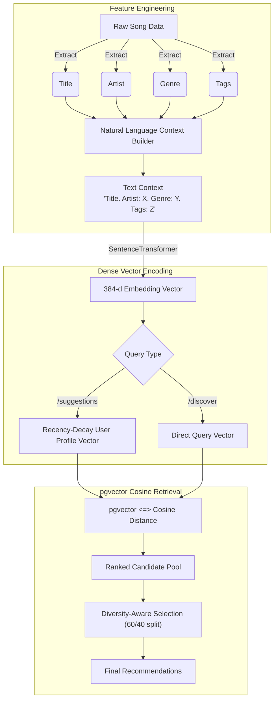
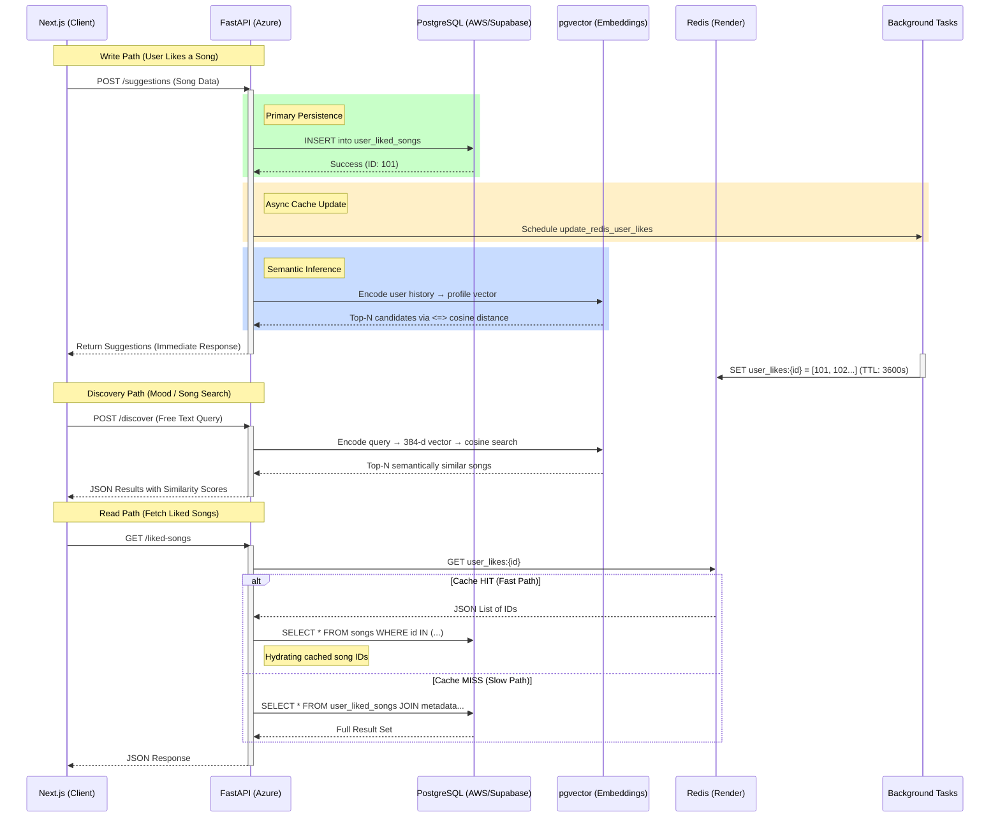

# Technical Architecture & Implementation Analysis: TuneTrace

## 1. Machine Learning Methodology

The TuneTrace recommendation engine employs a **Content-Based Filtering** architecture powered by **dense vector semantic search**. By encoding song metadata into 384-dimensional embeddings via `all-MiniLM-L6-v2` (SentenceTransformer) and leveraging `pgvector` cosine distance retrieval on Supabase/PostgreSQL, the system generates high-fidelity personalized recommendations without requiring user behavioral overlap.

### Algorithmic Pipeline (V3 — Semantic)

```mermaid
graph TD
    subgraph Feature_Engineering ["Feature Engineering"]
        A[Raw Song Data] -->|Extract| B(Title)
        A -->|Extract| C(Artist)
        A -->|Extract| D(Genre)
        A -->|Extract| E(Tags)
        
        B --> F["Natural Language Context Builder"]
        C --> F
        D --> F
        E --> F
        
        F --> G["Text Context<br/>'Title. Artist: X. Genre: Y. Tags: Z'"]
    end

    subgraph Encoding ["Dense Vector Encoding"]
        G -->|SentenceTransformer| H["384-d Embedding Vector"]
        H --> I{Query Type}
        I -->|"/suggestions"| J["Recency-Decay User Profile Vector"]
        I -->|"/discover"| K["Direct Query Vector"]
    end

    subgraph Retrieval ["pgvector Cosine Retrieval"]
        J --> L["pgvector <=> Cosine Distance"]
        K --> L
        L --> M["Ranked Candidate Pool"]
        M --> N["Diversity-Aware Selection (60/40 split)"]
        N --> O["Final Recommendations"]
    end
```

### Architectural Evaluation

The V3 semantic pipeline delivers several key advantages over the legacy TF-IDF approach:

1. **Dense Vector Encoding:** Song metadata is encoded into 384-dimensional dense vectors using `all-MiniLM-L6-v2`, capturing deep semantic relationships that sparse TF-IDF token matching inherently misses (e.g., "lo-fi chill beats" ↔ "relaxing ambient music").
2. **pgvector Cosine Distance:** Recommendations are computed entirely within PostgreSQL via the `<=>` cosine distance operator on an HNSW-indexed `embedding` column, eliminating the need to fetch all candidates into application memory.
3. **Recency-Decay User Profile:** User history vectors are weighted with exponential decay (`e^(-t)`), ensuring the profile adapts to evolving music tastes rather than averaging over stale preferences.
4. **Diversity-Aware Selection:** 60% of results are selected by strict similarity ranking; 40% are sampled pseudo-randomly from remaining high-scoring candidates to prevent echo chambers.
5. **Anti-Repetition Tracking:** Previously served recommendations are cached per-user in Redis (24h TTL) and excluded at the SQL level, guaranteeing catalog rotation.
6. **Free-Text Discovery (`/discover`):** A standalone endpoint accepts any free-text input — moods ("chill vibes for studying"), song names ("Bohemian Rhapsody"), or genre descriptions ("upbeat 90s hip-hop") — encodes it into a vector, and returns the closest semantic matches. No user history or authentication required.
7. **Decoupled Fallback:** If the semantic engine returns zero results (e.g., no vectorized songs yet), the system falls back to genre-based YouTube trending search.

---

## 2. Unified Persistence Architecture

The application utilizes a **Write-Through Caching** pattern with asynchronous cache updates to balance the high-throughput read requirements of the frontend with the transactional integrity of the primary database.

```mermaid
sequenceDiagram
    participant FE as Next.js (Client)
    participant API as FastAPI (Azure)
    participant DB as PostgreSQL (AWS/Supabase)
    participant PGV as pgvector (Embeddings)
    participant Cache as Redis (Render)
    participant BG as Background Tasks

    Note over FE, API: Write Path (User Likes a Song)
    FE->>API: POST /suggestions (Song Data)
    activate API
    
    rect rgb(200, 255, 200)
        Note right of API: Primary Persistence
        API->>DB: INSERT into user_liked_songs
        DB-->>API: Success (ID: 101)
    end

    rect rgb(255, 240, 200)
        Note right of API: Async Cache Update
        API->>BG: Schedule update_redis_user_likes
    end
    
    rect rgb(200, 220, 255)
        Note right of API: Semantic Inference
        API->>PGV: Encode user history → profile vector
        PGV-->>API: Top-N candidates via <=> cosine distance
    end

    API-->>FE: Return Suggestions (Immediate Response)
    deactivate API

    activate BG
    BG->>Cache: SET user_likes:{id} = [101, 102...] (TTL: 3600s)
    deactivate BG

    Note over FE, API: Discovery Path (Mood / Song Search)
    FE->>API: POST /discover (Free Text Query)
    activate API
    API->>PGV: Encode query → 384-d vector → cosine search
    PGV-->>API: Top-N semantically similar songs
    API-->>FE: JSON Results with Similarity Scores
    deactivate API

    Note over FE, API: Read Path (Fetch Liked Songs)
    FE->>API: GET /liked-songs
    activate API
    
    API->>Cache: GET user_likes:{id}
    alt Cache HIT (Fast Path)
        Cache-->>API: JSON List of IDs
        API->>DB: SELECT * FROM songs WHERE id IN (...)
        Note right of API: Hydrating cached song IDs
    else Cache MISS (Slow Path)
        API->>DB: SELECT * FROM user_liked_songs JOIN metadata...
        DB-->>API: Full Result Set
    end
    
    API-->>FE: JSON Response
    deactivate API
```

### Infrastructure Components

* **Presentation Layer:** Next.js application hosting the interactive UI.
* **Logic Layer:** FastAPI microservice deployed on Azure App Service.
* **ML Layer:** `all-MiniLM-L6-v2` SentenceTransformer model (~90 MB), loaded once at startup.
* **Vector Store:** PostgreSQL with `pgvector` extension (HNSW index, cosine distance).
* **Caching Layer:** Redis instance (hosted on Render) providing low-millisecond access to user history, configured with a 1-hour TTL.
* **Persistence Layer:** PostgreSQL database (hosted via Supabase/AWS) serving as the source of truth for user relations and song metadata.

---

## 3. CI/CD Automation Pipeline

The deployment lifecycle is managed via GitHub Actions, establishing a continuous delivery pipeline to the Azure App Service.

```mermaid
graph LR
    subgraph Source_Control [Source Control]
        A[Push to 'main'] --> B(Trigger Workflow)
    end

    subgraph Build_Job ["CI: Build & Migrate Job"]
        B --> C[Checkout Code]
        C --> D[Setup Python 3.11]
        D --> E[Install Dependencies]
        E --> M[Run Alembic Migrations]
        M --> F["Build & Push Docker Image"]
    end

    subgraph Deploy_Job ["CD: Deploy Job Azure"]
        F --> H[Azure Login via OIDC]
        H --> I[Deploy to Web App]
    end

    subgraph Production [Environment]
        I --> J["Azure Web App: 'song-suggest-fastapi'"]
        J --> K[Production Slot]
    end
```

### Configuration Specifications

* **Artifact Optimization:** The pipeline utilizes the `!antenv/` exclusion pattern during artifact upload. This prevents the local virtual environment from being transmitted to Azure, allowing the platform's native Oryx build engine to handle dependency resolution efficiently.
* **Secure Authentication:** The pipeline implements OpenID Connect (OIDC) via `azure/login@v2`. This protocol eliminates the need for long-lived static credentials, relying instead on short-lived tokens authenticated against the Azure Tenant ID and Subscription ID.
* **Pre-Deployment Migrations:** Alembic database schema migrations are executed natively within the standalone deployment job immediately prior to Web App artifact handoff, guaranteeing schema-code consistency and preventing startup race conditions.
* **Model Weight Caching:** GitHub Actions caches `~/.cache/huggingface/` to avoid re-downloading the ~80 MB SentenceTransformer model on every CI run.

---

## 4. Metadata Enrichment Pipeline

To guarantee a diverse and densely populated catalog for the recommendation vectors, TuneTrace abstracts dataset expansion into an autonomous lifecycle.

### Daemon-based Local Enrichment
Upon FastAPI application startup (`lifespan` context), a non-blocking background daemon thread is spawned. This thread queries the database for songs lacking enriched metadata, batches them (n=50), and executes network requests against the standard YouTube Data API (`part=snippet`). It extracts actual categorical genres from unstructured tag arrays and persists them safely via HTTP exponential backoff.

### V3 Backfill Daemon
A standalone script (`v3_janitor.py`) batch-migrates existing V2 rows to V3 by encoding their metadata into 384-d vectors and writing them back to the `embedding` column. This process runs outside the FastAPI main thread to avoid GIL contention.

### Global Trending Cron Aggregator
Driven by GitHub Action schedules (`cron: '0 0 * * 0'`), a separate serverless routine queries the YouTube `mostPopular` video chart for music strictly. It handles pagination, enforces deduplication against the primary Supabase cluster, generates V3 embeddings during ingestion, and injects hundreds of high-quality verified candidates globally, guaranteeing the fallback algorithms never suffer from structural cold starts.
